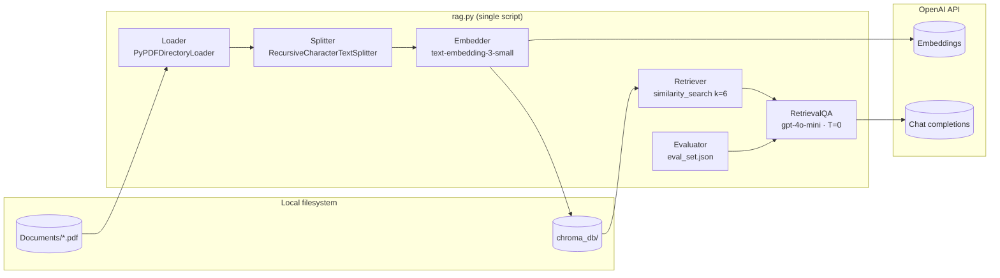

<div align="center">

# RAG-Powered Document Q&A System

**A single-script Retrieval-Augmented Generation pipeline over local PDF research papers.**

*Built end-to-end: load → chunk → embed → retrieve → generate → evaluate.*

[](https://www.python.org/)
[](https://python.langchain.com/)
[](https://platform.openai.com/docs/models)
[](https://docs.trychroma.com/)
[](LICENSE)

</div>


</div>

## At a glance

| | |
|:---|:---|
| **Corpus** | 6 PDFs on power-system topology, PMU/synchrophasor graph models, and LVQ neural-network branch-event identification. |
| **Loader** | `PyPDFDirectoryLoader` (via `pypdf`) — yields **one `Document` per page** (49 pages from 6 PDFs). |
| **Chunking** | `RecursiveCharacterTextSplitter` (1000 chars / 150 overlap) → **244 chunks**. |
| **Embeddings** | OpenAI `text-embedding-3-small` (1536-dim). |
| **Vector store** | Local, persisted **ChromaDB** (`./chroma_db`, collection `papers`). |
| **Generation** | `RetrievalQA` (chain_type=`stuff`) + `gpt-4o-mini` at `temperature=0`, top-k = **6**. |
| **Grounding** | Custom prompt forbids invention; answers must cite sources inline as `[source: <filename> p.<page>]`. |
| **Evaluation** | 5-item eval set with retrieval / faithfulness / correctness scorecard (incl. one refusal test). |

---

## Pipeline at a glance

```
┌─────────────┐   ┌────────────┐   ┌──────────────┐   ┌──────────────┐   ┌──────────────┐   ┌────────────┐
│  1. Load    │──▶│  2. Chunk  │──▶│  3. Embed &  │──▶│  4. Retrieve │──▶│  5. Generate │──▶│ 6. Evaluate│
│ PyPDFDir.   │   │ Recursive  │   │     Store    │   │  similarity  │   │ RetrievalQA  │   │ R / F / C  │
│  Loader     │   │ Splitter   │   │  Chroma +    │   │    search    │   │   + prompt   │   │  scorecard │
└─────────────┘   └────────────┘   │  OpenAI emb. │   └──────────────┘   └──────────────┘   └────────────┘
                                   └──────────────┘
```

| Step | What it produces |
|---|---|
| 1. Load | 49 page-level `Document`s from 6 PDFs |
| 2. Chunk | 244 chunks (138–1000 chars) |
| 3. Embed & store | 244 vectors in `./chroma_db` |
| 4. Retrieve | Top-k chunks per query (validated before the LLM) |
| 5. Generate | Grounded answers with inline source citations |
| 6. Evaluate | Retrieval / faithfulness / correctness scorecard |

---

## How it works



---

## Tech stack

| Layer | Tool | Version / Model | Role |
|---|---|---|---|
| Language | [Python](https://www.python.org/) | 3.14 | Runtime |
| Framework | [LangChain](https://python.langchain.com/) | 1.2 (+ `langchain-classic`) | RAG orchestration |
| Document loader | [`PyPDFDirectoryLoader`](https://python.langchain.com/docs/integrations/document_loaders/pypdfdirectory/) | via `pypdf` | PDF → LangChain `Document`s |
| Text splitter | [`RecursiveCharacterTextSplitter`](https://python.langchain.com/docs/concepts/text_splitters/) | — | Chunking (1000 chars / 150 overlap) |
| Embeddings | [OpenAI](https://platform.openai.com/docs/guides/embeddings) | `text-embedding-3-small` (1536-dim) | Vectorize chunks |
| Vector DB | [ChromaDB](https://docs.trychroma.com/) | local, persisted | Similarity search |
| LLM | [OpenAI](https://platform.openai.com/docs/models) | `gpt-4o-mini` (`temperature=0`) | Grounded answer generation |
| Config | [`python-dotenv`](https://pypi.org/project/python-dotenv/) | — | Load `OPENAI_API_KEY` from `.env` |

---

## Repository layout

| Path | Role |
|------|------|
| `rag.py` | Single-script pipeline (Steps 1–6) |
| `rag_walkthrough.ipynb` | Interactive notebook companion — same pipeline, one cell per step, with explanations |
| `Documents/` | Source PDFs (corpus) |
| `chroma_db/` | Persisted Chroma vector store (auto-generated, gitignored) |
| `eval_set.json` | Mini eval set (5 Q&A pairs) |
| `requirements.txt` | Python dependencies |
| `.env.example` | Template for `.env` (`OPENAI_API_KEY`) |
| `README.md` | This file — full project documentation |
| `LICENSE` | MIT license text |

```
Document Q&A System/
├── Documents/              # Source PDFs (corpus)
├── chroma_db/              # Persisted Chroma vector store (auto-generated, gitignored)
├── .venv/                  # Virtual environment (gitignored)
├── .env                    # OPENAI_API_KEY (gitignored)
├── .env.example            # Template for .env
├── rag.py                  # Single script — the whole pipeline
├── rag_walkthrough.ipynb   # Interactive step-by-step notebook
├── eval_set.json           # Mini eval set (5 Q&A pairs)
├── requirements.txt
├── LICENSE
└── README.md
```

---

## Prerequisites

- **Python** 3.11+ (developed on 3.14)
- **OpenAI API key** (used for both embeddings and `gpt-4o-mini`)
- Windows PowerShell examples below; equivalent `bash` commands work on macOS/Linux.

---

## Environment variables

Configuration is loaded from a root `.env` file via `python-dotenv`.

| Variable | Required | Description |
|----------|:--------:|-------------|
| `OPENAI_API_KEY` | Yes | OpenAI API key. Used for both the embedding model and the chat model. |

Copy the template and fill in your key:

```env
OPENAI_API_KEY=sk-...
```

> `.env` is gitignored — never commit your real key.

---

## Local setup

```powershell
# 1. Create and activate the virtual environment
python -m venv .venv
.\.venv\Scripts\Activate.ps1

# 2. Install dependencies
pip install -r requirements.txt

# 3. Configure your API key
Copy-Item .env.example .env
# then edit .env and paste your real OPENAI_API_KEY

# 4. Run the pipeline
python rag.py
```

### Running the full pipeline

```powershell
.\.venv\Scripts\Activate.ps1
python rag.py
```

The script runs Steps 1–6 end-to-end (load → chunk → embed/store → retrieval test → RAG Q&A → evaluation) and prints results for each step. On subsequent runs, the embedding step is skipped (Chroma store is reused); **delete `chroma_db/` to force a rebuild** after changing chunking or the embedding model.

### Interactive walkthrough (Jupyter)

Prefer to step through the pipeline cell-by-cell with explanations alongside the code? Open the companion notebook:

```powershell
.\.venv\Scripts\Activate.ps1
jupyter notebook rag_walkthrough.ipynb
```

`rag_walkthrough.ipynb` mirrors `rag.py` step-for-step (same constants, same prompt, same grader) but splits each stage into its own cell with markdown explaining the **why** behind it. It also includes an editable *"Try your own question"* cell at the end so you can probe the system without touching the pipeline code. Select the `.venv` kernel and Run All.

---

## Corpus

`Documents/` contains **6 PDFs** on power-system topology, graph models from synchrophasor/PMU data, and neural-network-based branch-event identification.

---

# Workflow

> The project was built **incrementally, one step at a time** — the sections below mirror that build order.

## Step 1 — Load

**Goal:** load the source PDFs into LangChain `Document` objects.

**Loader:** `PyPDFDirectoryLoader` (from `langchain-community`) — one `Document` per page.

**Output:**
- Number of PDF files: **6**
- Number of pages (LangChain `Document`s): **49**
- Sample: page 0 of `An_Efficient_and_Reliable_Electric_Power_Transmission_Network_Topology_Processing.pdf`

> Note: `PyPDFDirectoryLoader` yields **one Document per page**, not per file. That's why 6 PDFs produce 49 Documents.

## Step 2 — Chunk

**Goal:** split pages into retrieval-friendly chunks.

**Splitter:** `RecursiveCharacterTextSplitter`
- `chunk_size = 1000` chars
- `chunk_overlap = 150` chars

**Output:**
- Total chunks created: **244**
- Smallest chunk: **138** chars
- Largest chunk: **1000** chars

## Step 3 — Embed + Store

**Embedding model:** `text-embedding-3-small` (OpenAI) — 1536-dim, cheap, high quality.

**Vector store:** **ChromaDB**, persisted to `./chroma_db` in a collection called `papers`.

- On first run: embeds all 244 chunks and persists them.
- On subsequent runs: reuses the existing store (no re-embedding, no extra API cost).
- To force a rebuild: delete the `chroma_db/` folder.

**Output:**
- Vectors stored: **244** (one per chunk)

### Why this combo?

| Component | Choice | Reason |
|---|---|---|
| Embedding | `text-embedding-3-small` | Best quality/cost balance (~$0.02/1M tokens), fast |
| Vector DB | ChromaDB | Zero-setup, persists locally, perfect for a single-script project |

## Step 4 — Test Retrieval (before the LLM!)

**Goal:** validate that the retriever actually surfaces the right chunks before wiring up an LLM. This is the single biggest quality lever in a RAG system.

Three test queries were hand-picked to target distinct papers in the corpus:

| # | Query | Targeted paper(s) |
|---|---|---|
| 1 | *"How is electric power transmission network topology processed efficiently?"* | Topology Processing paper |
| 2 | *"How are graph models of power networks constructed from synchrophasor PMU data?"* | Data-Driven Graph Construction + Graph Models Using Synchrophasor Data |
| 3 | *"How does an LVQ neural network identify power system network branch events online?"* | LVQ Neural Network paper |

For each query, the top **k=3** chunks are retrieved via `vs.similarity_search(query, k=3)`.

### Retrieval relevance analysis

#### Q1 — Topology processing

| # | Source | Relevant? | Why |
|---|---|---|---|
| 1 | `An_Efficient_and_Reliable..._Topology_Processing.pdf` (p.0) | **Yes** | Title/abstract page of the exact paper — directly answers the query. |
| 2 | Same paper (p.16) | **Partial** | References section. On-topic citations, but bibliography text, not explanatory. |
| 3 | `Data-Driven_Graph_Construction...pdf` (p.0) | **Partial** | Related (graph construction) but not the same concept as topology processing. |

#### Q2 — Graph models from PMU data

| # | Source | Relevant? | Why |
|---|---|---|---|
| 1 | `Data-Driven_Graph_Construction...pdf` (p.2) | **Yes** | PMU data collection methodology at 30 Hz on RTDS — direct match. |
| 2 | Same paper (p.2) | **Yes** | Describes the domain-specific graph-score algorithm using synchrophasor data. |
| 3 | `Graph_Models...Synchrophasor_Data.pdf` (p.0) | **Yes** | Different paper, same topic — excellent cross-document recall. |

#### Q3 — LVQ neural network

| # | Source | Relevant? | Why |
|---|---|---|---|
| 1 | `LVQ_Neural_Network..._Branch_Events.pdf` (p.0) | **Yes** | Title/author page of the exact paper. |
| 2 | Same paper (p.0) | **Yes** | Abstract explicitly stating LVQ is the solution for online branch-event ID. |
| 3 | Same paper (p.4) | **Partial** | References section of the same paper. |

#### Overall

**6 / 9 chunks strongly relevant, 3 / 9 partially relevant, 0 / 9 off-topic.**
Paper-level precision is perfect — every top-ranked hit came from the correct paper.

**Observed pattern:** references / bibliography pages sometimes rank highly because they are keyword-dense. Possible mitigations (not implemented yet):

1. Strip references sections during loading (drop content after `"REFERENCES"`).
2. Use `similarity_search_with_score` and threshold on distance.
3. Increase `k` and let the LLM ignore weak chunks at generation time.

Retrieval quality is strong enough to proceed to the generation step.

## Step 5 — Build the RAG chain

**Goal:** wire the retriever into an LLM with a custom prompt, so the model answers strictly from retrieved context and cites its sources.

**Components:**
- **Chain:** `RetrievalQA.from_chain_type(chain_type="stuff")` from `langchain_classic` (the legacy chains package in LangChain 1.x).
- **LLM:** `gpt-4o-mini`, `temperature=0` for faithful, deterministic answers.
- **Retriever:** `vs.as_retriever(search_kwargs={"k": 6})`.
- **Custom prompt:** constrains the model to use only the provided context, say *"I don't know based on the provided documents."* when it can't answer, and cite sources inline as `[source: <filename> p.<page>]`.
- **`document_prompt`:** prefixes each retrieved chunk with its source/page metadata BEFORE it reaches the LLM — without this, inline citations come out as literal `<filename>` placeholders.

**Prompt template:**

```
You are a helpful research assistant answering questions about
electric power transmission network research papers.

Use ONLY the context below to answer the question. If the context does not contain
the answer, say "I don't know based on the provided documents." Do not invent facts.
Be concise and technical. Cite sources inline as [source: <filename> p.<page>].

Context:
{context}

Question: {question}

Answer:
```

### Tuning note: `k = 4 → k = 6`

The first run with `k = 4` caused Q1 to return *"I don't know"* even though the corpus clearly contains the answer. Reason: the top-4 chunks for that query were the title page and a references page of the correct paper — keyword-dense but content-poor. Increasing `k` to 6 pulled in body-content chunks and the model produced a proper answer. This is the same references-page pattern flagged in the Step 4 analysis — a good example of why retrieval should be validated before touching the LLM.

### Generated answers (summary)

| # | Question | Answer highlights | Cited sources |
|---|---|---|---|
| 1 | Efficient topology processing | PMU-driven real-time monitoring, automated topology processing, knowledge graphs and GNNs for identifying topology changes | Topology Processing paper (p.0), Data-Driven Graph Construction paper (p.0) |
| 2 | Graph models from PMU data | Exhaustive search over the EPTN graph, Gaussian Graphical Models, false-edge pruning, flow-graph construction, domain-specific graph-score algorithm | Data-Driven Graph Construction paper (p.0, p.2) |
| 3 | LVQ NN for online branch events | PMU → PDC → LVQ pipeline; cellular computational network (CCN) distributes the load; classifies transmission line and transformer outages on the IEEE 12-bus benchmark | LVQ Neural Network paper (p.0) |

All three answers are grounded in the retrieved context, include inline `[source: ... p.X]` citations, and show the top source documents underneath via `return_source_documents=True`.

---

## Step 6 — Evaluate

**Goal:** build a small, hand-curated eval set and score the pipeline on three dimensions — **retrieval**, **faithfulness**, and **correctness**. Retrieval alone is not enough; you also need to know whether the LLM is grounding its answers and actually answering correctly.

**Eval set:** `eval_set.json` — 5 questions with expected answers, expected source files, and keyword checks. The set deliberately includes one **refusal test** (a question whose answer is not in the corpus) to verify the model declines instead of hallucinating.

| # | Question (abridged) | Targeted paper | Type |
|---|---|---|---|
| 1 | PMU sampling rate (Hz)? | Data-Driven Graph Construction | factual |
| 2 | Test system used on the RTDS? | Data-Driven Graph Construction | factual |
| 3 | Neural net + IEEE benchmark for branch events? | LVQ Neural Network | factual |
| 4 | Distributed architecture for event ID? | LVQ / Distributed Identification | factual |
| 5 | Do the papers propose deep reinforcement learning? | — (not covered) | **refusal** |

### Grading rubric (auto-graded)

- **Retrieval ✅** — at least one expected source file appears in the retrieved chunks (waived for refusal questions).
- **Faithfulness ✅** — the answer cites at least one of the retrieved files inline AND is not a refusal (for refusal questions, faithfulness ✅ = model correctly refused).
- **Correctness ✅** — all expected keywords appear in the answer (for the refusal question, correctness ✅ = the answer contains "I don't know").

### Results

| # | Retrieval | Faithfulness | Correctness | Notes |
|---|:---:|:---:|:---:|---|
| 1 | ✅ | ✅ | ✅ | Answer: *"PMUs collect data at a rate of 30 Hz..."* |
| 2 | ✅ | ✅ | ✅ | Answer: *"...two-area four-machine power system model on a real-time digital simulator (RTDS)..."* |
| 3 | ✅ | ✅ | ✅ | Answer: *"Learning Vector Quantization (LVQ) neural network... IEEE 12-bus benchmark..."* |
| 4 | ✅ | ✅ | ✅ | Answer: *"A cellular computational network (CCN)..."* |
| 5 | ✅ | ✅ | ✅ | Model correctly refused: *"I don't know based on the provided documents."* |

**Scorecard:**

| Metric | Score |
|---|---|
| Retrieval | **5 / 5** |
| Faithfulness | **5 / 5** |
| Correctness | **5 / 5** |

### Caveats

- Auto-grading is a coarse filter (keyword overlap, filename presence). It is **not** a substitute for human review — spot-check each answer against the PDFs, especially for longer or more nuanced questions.
- The eval set is intentionally small (5 items) and skews toward factual questions. For a production system you'd want 30–100 items covering multi-hop questions, adversarial / trick questions, and more refusal tests.
- Faithfulness here only checks whether a retrieved source is cited; it does not verify that each specific claim in the answer maps to a specific chunk. A stronger check would use an LLM-as-judge pass against the retrieved context.

---

## Troubleshooting

| Symptom | Likely cause | Fix |
|---------|--------------|-----|
| `openai.AuthenticationError` / 401 | `OPENAI_API_KEY` missing or invalid | Create `.env` from `.env.example` and paste a valid key; make sure the shell was restarted so `python-dotenv` picks it up. |
| Model returns *"I don't know"* on answerable questions | Top-k retrieved only title/references pages | Increase `TOP_K` in `rag.py` (already raised from 4 → 6), or strip references pages during loading. |
| Chroma reports 0 vectors even after a run | Previous run errored before `add_documents` completed | Delete `chroma_db/` and rerun `python rag.py`. |
| Inline citations appear as literal `<filename>` | `document_prompt` not wired into the chain | Keep the `document_prompt` argument in `build_qa_chain` — it injects `[source: ... p.X]` before each chunk. |
| `ModuleNotFoundError: langchain_classic` | Dependencies not installed in the active venv | Activate `.venv` then `pip install -r requirements.txt`. |
| Answers changed after tweaking chunking/embeddings | Old vectors still cached | Delete `chroma_db/` to force a full re-embed. |

---

## License

This project is released under the **MIT License**. See the [`LICENSE`](LICENSE) file in the repository root for the full text.
